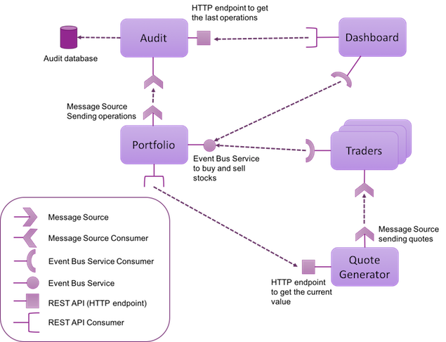

In this scenario, you will learn more about Reactive Microservices using [Eclipse Vert.x](https://vertx.io), one of the runtimes included in [Red Hat OpenShift Application Runtimes](https://developers.redhat.com/products/rhoar).

## The Micro-Trader Application
This scenario is the first one in a list of scenarios that will walk you through building a Reactive application using Vert.x illustrating what Vert.x is. It is called the Micro-Trader application and has the following characteristics:
                                                          
* composed of microservices 
* based on Vert.x
* distributed
* built as a reactive system

The Micro-Trader is a fake financial app, where we will be making (virtual) money. The application is composed of the following microservices:

* The quote generator - this is an absolutely unrealistic simulator that generates the quotes for 3 fictional companies MacroHard, Divinator, and Black Coat. The market data is published on the Vert.x event bus.
* The traders - these are a set of components that receives quotes from the quote generator and decides whether or not to buy or sell a particular share. To make this decision, they rely on another component called the portfolio service.
* The portfolio - this service manages the number of shares in our portfolio and their monetary value. It is exposed as a service proxy, i.e. an asynchronous RPC service on top of the Vert.x event bus. For every successful operation, it sends a message on the event bus describing the operation. It uses the quote generator to evaluate the current value of the portfolio.
* The audit - this is to keep a list of all our operations (yes, that’s the law). The audit component receives operations from the portfolio service via an event bus and address. It then stores theses in a database. It also provides a REST endpoint to retrieve the latest set of operations.
* The dashboard - some UI to let us know when we become rich.

Let’s have a look at the architecture:

The application uses several types of services:

* HTTP endpoint (i.e. REST API) - this service is located using an HTTP URL.
* Service proxies - these are asynchronous services exposed on the event bus using an RPC interaction mechanism, the service is located using an (event bus) address.
* Message sources - these are components publishing messages on the event bus, the service is located using an (event bus) address.

The dashboard presents the available services, the value of each company’s quotes, the latest set of operations made by our traders and the current state of our portfolio. It also shows the state of the different circuit breakers.

#### NOTE

In this first scenario, we will focus on creating the quote generator microservice. The quote generator is a simulator that generates the quotes for 3 fictional companies MacroHard, Divinator, and Black Coat. The market data is published on the Vert.x event bus. It also publishes an HTTP endpoint to get the current value of the quote.

## What is Eclipse Vert.x?

If you go on the Vert.x web site, Vert.x is defined as "a toolkit for building reactive applications on the JVM". There are a three important points in this description: `toolkit`, `reactive` and `"on the JVM"`

Firstly, Vert.x is a `toolkit`. Meaning, Vert.x is not an application server, a container nor a framework. It’s not a JavaScript library either. Vert.x is a plain old jar file, so a Vert.x application is an application that uses this jar file. Vert.x does not define a packaging model, all Vert.x components are plain boring jar files. How does this impact you and your application? Let’s imagine you are using a build tool such as Maven or Gradle, to make your application a Vert.x application just add the vertx-core dependency. Wanna use another Vert.x components, just add it as a dependency. It’s simple, burden-less. Starting the application is a simple class with the public static void main(String[] args) entry point. No specific IDE or plugin to install to start using Vert.x.

Secondly, Vert.x is `reactive`. It is specifically made to build reactive applications, or more appropriately, systems. Reactive systems [1] has been defined in the Reactive Manifesto. Although, it’s not long document to read, we will further reduce it to these 4 bullet points:
* Responsive: a reactive system needs to handle requests in a reasonable time (I let you define reasonable).
* Resilient: a reactive system must stay responsive in the face of failures (crash, timeout, 500 errors…​), so it must be designed for failures and deal with them appropriately.
* Elastic: a reactive system must stay responsive under various loads. As a consequence, it must scale up and down, and be able to handle the load with minimal resources.
* Message driven: components from a reactive system interacts using `asynchronous message-passing`.

Also, Vert.x is event-driven and also non-blocking. Events are delivered in an event loop that `must never be blocked`. Let’s explain why. Unlike traditional, let’s say "enterprise", systems, Vert.x uses a very small number of threads. Some of these threads are event loops, they are responsible for dispatching the events in `Handlers`. If you block this thread, the events won’t be delivered anymore. This execution model impacts how you write your code, instead of the traditional model of blocking code, your code is going to be asynchronous and non-blocking.

Finally, Vert.x applications runs `"on the JVM"` the Java Virtual Machine (8+). This means Vert.x applications can be developed using any language that runs on the JVM. Including Java(of course), Groovy, Ceylon, Ruby, JavaScript, Kotlin and Scala. We can even mix and match any combination of all these languages. The polyglot nature of Vert.x application allows you use the most appropriate language for the task.

Vert.x lets you implement distributed applications, either by using the built-in TCP and HTTP server and client, but also using the Vert.x event bus, a lightweight mechanism to send and receive messages. With the event bus, you send messages to `addresses`. It supports three modes of distributions:
1. point to point: the message is sent to a single consumer listening on the address
2. publish / subscribe: the message is received by all the consumers listening on the address
3. request / reply: the message is sent to a single consumer and let it reply to the message by sending another message to the initial sender

You might still want to ask: What kind of applications can I use Vert.x for? We say, Vert.x is incredibly flexible - whether it’s simple network utilities, sophisticated modern web applications, HTTP/REST microservices, high volume event processing or a full blown backend message-bus application, Vert.x is a great fit. It’s fast, and does not constraint you. Last but not least, Vert.x provides appropriate tools to build reactive systems; systems that are: responsive, elastic, resilient and asynchronous!